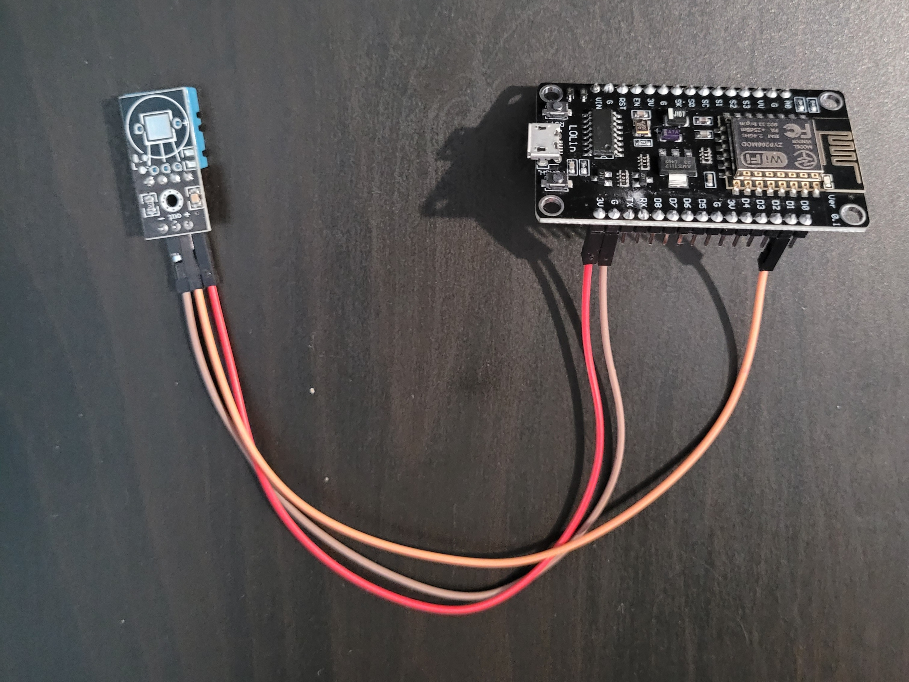

# ESP8266 DHT11 Temperature & Humidity Logger with Web Interface and History

This project uses an **ESP8266** (NodeMCU) and a **DHT11** sensor to measure ambient **temperature and humidity**, log the readings to a **local database**, and display both current and historical data on a web interface over Wi-Fi.

---

## Components

- ESP8266 (NodeMCU or similar)
- DHT11 Temperature and Humidity Sensor
- 10kΩ pull-up resistor (optional for signal stability)
- Breadboard & jumper wires (if DHT11 has no module)

---

## Wiring

| DHT11 Pin | Connects To               |
|-----------|---------------------------|
| VCC       | 3.3V (or 5V if supported) |
| DATA      | D1                        |
| GND       | GND                       |

> *Note: Use a 10kΩ pull-up resistor between DATA and VCC if the sensor has no module.*

---

## Software Requirements

### Arduino IDE

- Install these libraries:
  - `DHT` (by Adafruit)
  - `ESP8266WiFi`
  - `ESP8266WebServer`
  - `ESP8266HTTPClient`

---

## Setup and running

1. Connect the DHT11 module to the ESP8266 as shown.
2. Install required libraries in the Arduino IDE.
3. Open the provided `.ino` file.
4. Update the Wi-Fi SSID and password in the code.
5. Upload the sketch to your ESP8266.
6. Open the Serial Monitor to find the device IP address.
7. Open a browser and navigate to the IP to view temperature and humidity readings.

---

## Web Interface

The ESP8266 hosts a lightweight webpage that displays the current temperature and humidity. The page auto-refreshes at set intervals to show the latest sensor readings. In addition to the live data page, there is also a historical page that shows the recent readings in a chart and a page that shows all available sensor readings.
